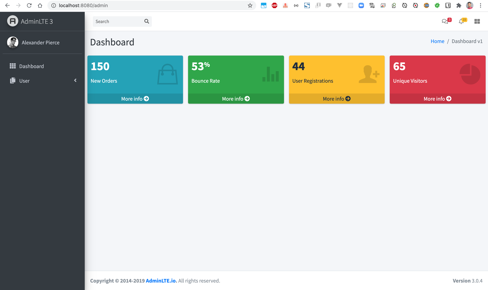
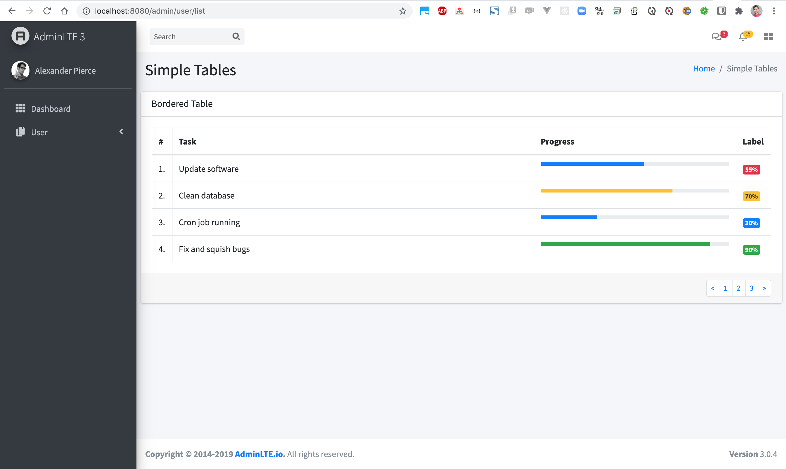
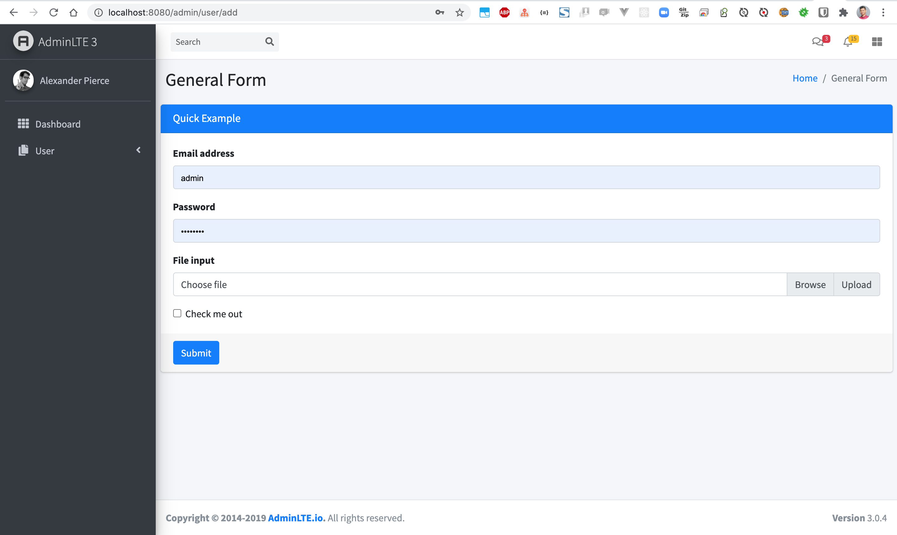

# springboot-adminlte3
### Things todo list:
1. Clone this repository: `git clone https://github.com/hendisantika/springboot-adminlte3.git`
2. GO inside the folder: `cd springboot-adminlte3`
3. Run the application: `mvn clean spring-boot:run`
4. Open your favorite browser: http://localhost:8080/admin

### Image Screen shot

Home Page

User List Page

User Add Page

